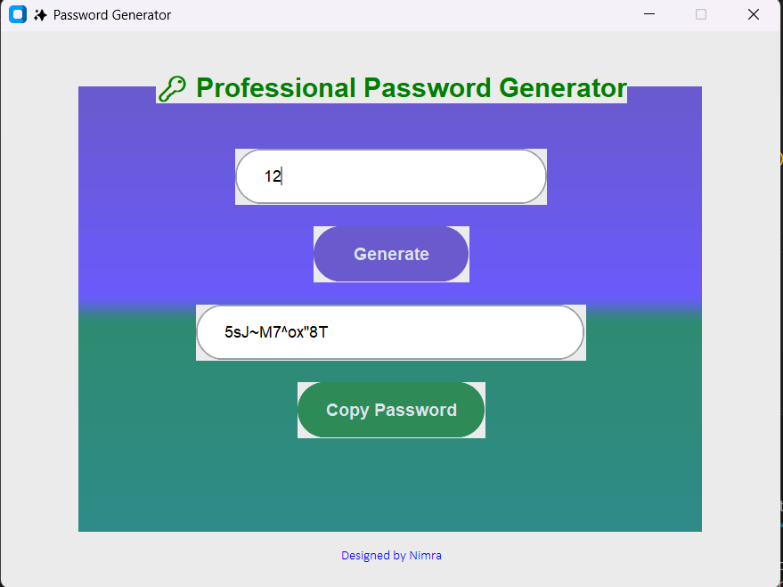

# 🔑 Password Generator


A modern, professional **Password Generator** built with **Python** and **CustomTkinter**.  
It features a beautiful glassmorphism UI with gradient background, stylish buttons, and copy-to-clipboard functionality.

---

## ✨ Features
- 🎨 Gradient + Glassmorphism styled UI  
- 🔐 Generate strong random passwords instantly  
- 📋 One-click "Copy Password" button  
- 💻 Professional, stylish, and user-friendly design  

---

## 📸 Preview


---

## 🛠 Installation
1. Clone the repository:
   ```bash
   git clone https://github.com/nimra833/Password-Generator.git
   cd Password-Generator

2. Install dependencies:
    pip install -r requirements.txt

3. Run the app:
    python PG.py


Future Improvements

🌙 Add dark mode toggle

📊 Add password strength indicator

💾 Export generated passwords

⚡ Add animations and themes


